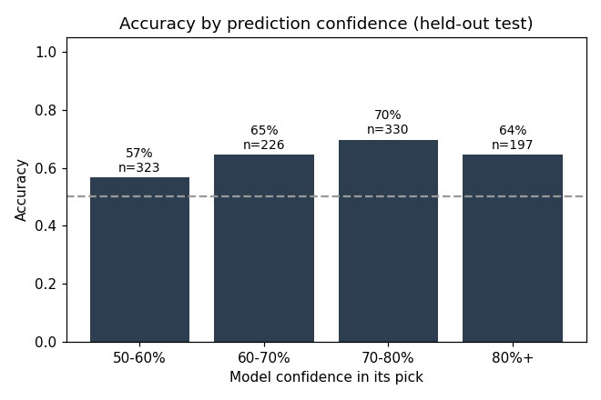
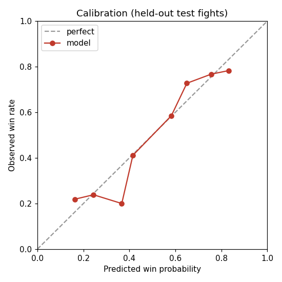
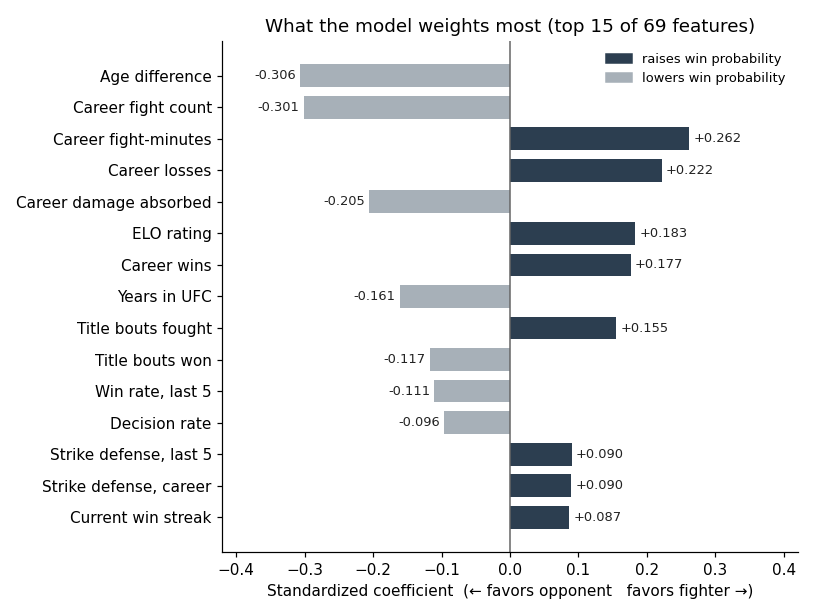
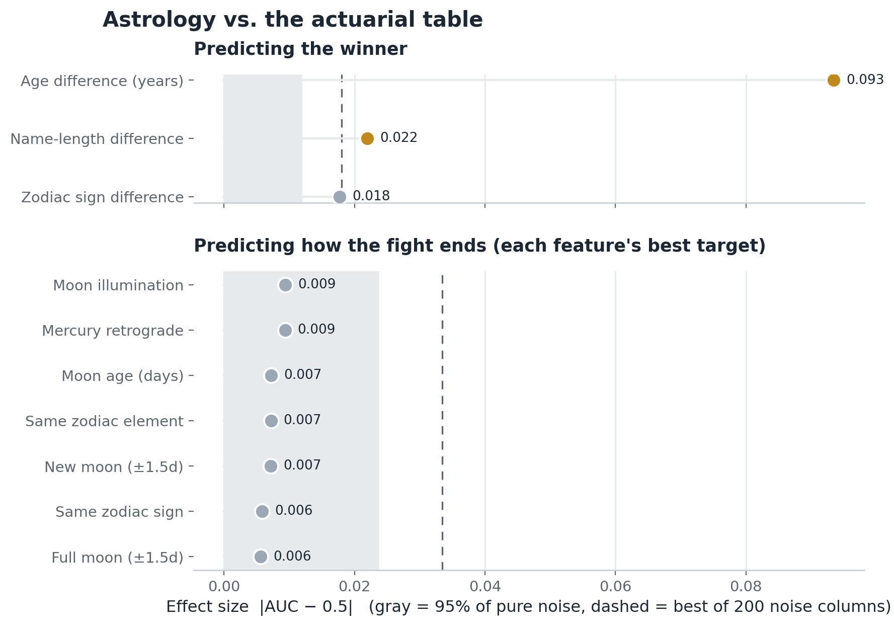
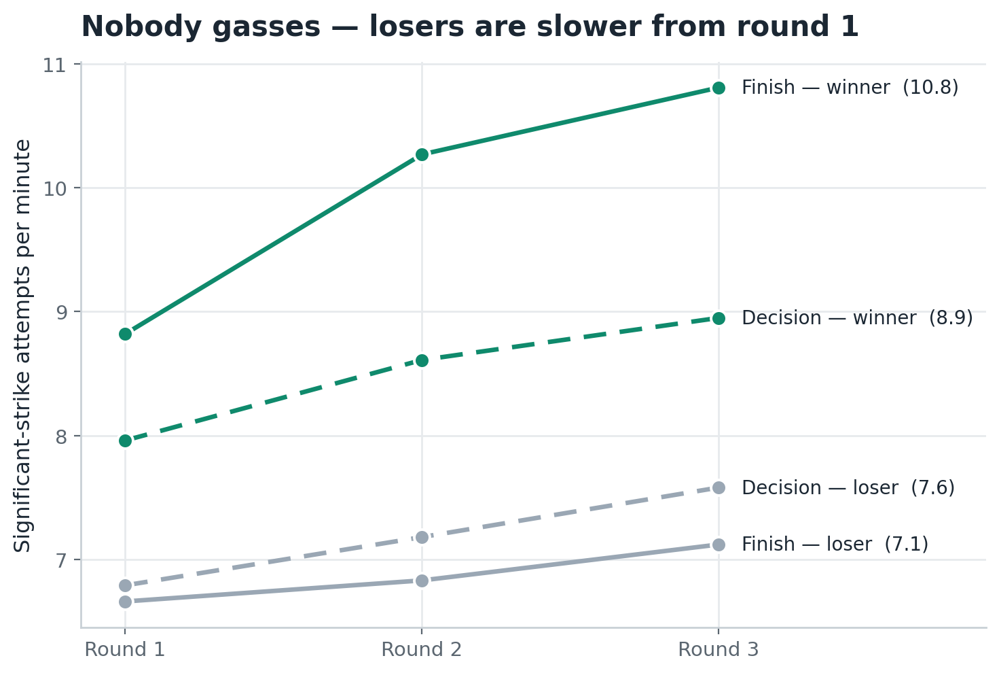

<h1 align="center">UFC Fight Winner Predictor</h1>

<p align="center">
  Predicting UFC fights from <strong>public pre-fight statistics alone</strong>, and knowing <em>when</em> it's right.
</p>

<p align="center">
  <strong>66.0%</strong> per-fight accuracy &nbsp;·&nbsp;
  <strong>0.702</strong> ROC AUC &nbsp;·&nbsp;
  <strong>78.1%</strong> on confident picks &nbsp;·&nbsp;
  <strong>8,621</strong> fights (1998–2026) &nbsp;·&nbsp;
  <strong>69</strong> features
</p>

---

A machine-learning study of how far a UFC fight outcome can be predicted from
**public, pre-fight statistics alone**: striking, grappling, defense, recent
form, strength of schedule, physical attributes, and a purpose-built ELO
rating. Trained on **8,621 UFC fights (1998–2026)** and evaluated on 538 fights
it never saw during training or model selection.

This README is the full write-up: the data, the 69 features, which model won and
*why* its coefficients say what they say, the evaluation discipline behind the
headline number, and every idea that was tried and rejected.

---

## Results

Evaluated on **all 538 UFC fights from July 2025 through July 2026**, none of
which were used in training or model selection:

| Metric | Value |
|---|---:|
| **Winner accuracy (per fight)** | **66.0%** |
| ROC AUC (per fight) | 0.702 |
| Brier score | 0.217 |
| ELO-rating baseline (pick the higher-rated fighter) | 60.0% |
| "Pick the more experienced fighter" baseline | 44.2% |

The model beats a strong ELO baseline by **+6 points** using only information
available before the fight. More usefully, **it knows when it's likely to
be right.** Accuracy climbs monotonically with the model's own confidence:

<p align="center">
  
</p>

| Model confidence in its pick | Share of fights | Accuracy |
|---|---:|---:|
| 50–60% (near coin-flips) | 40% | 57% |
| 60–70% | 25% | 64% |
| 70–80% | 21% | 77% |
| 80%+ | 14% | 78% |

Read as coverage thresholds, the same story:

| Confidence threshold | Coverage | Accuracy |
|---|---:|---:|
| ≥ 60% | 59.7% | 72.0% |
| **≥ 70%** | **35.1%** | **77.3%** |
| **≥ 75%** | **34.8%** | **78.1%** |
| ≥ 80% | 14.1% | 77.6% |

Roughly **40% of fights are near coin-flips even to the model**. That is the
variance of the sport itself, not a gap the box score can close. The model's
skill lives in the other 60%, and it flags which fights those are.

The probabilities are also **calibrated** (a predicted 70% really does win about
70% of the time) because the winning model is isotonic-calibrated on the
validation period:

<p align="center">
  <br>
  <sub><em>Predicted win probability vs. actual win rate, held-out test fights. Points track the diagonal closely; the only real drift is slight overconfidence in the very top bin (~0.86 predicted → ~0.73 observed).</em></sub>
</p>

---

## Try it

```bash
git clone https://github.com/BeForce1/ufc-fight-predictor.git
cd ufc-fight-predictor
pip install -r requirements.txt

python predict.py "Islam Makhachev" "Charles Oliveira"
```

```
==========================================================
  UFC FIGHT WINNER PREDICTION
==========================================================
  Islam Makhachev            86.7%  [########################----]
  Charles Oliveira           13.3%  [####------------------------]

  Pick: Islam Makhachev  (86.7%)

  PRE-FIGHT STATS                       A           B
  UFC fights                      18          37
  Career wins                     17          25
  Win streak                      16           2
  Reach (cm)                     178         188
  Sig str/min                   2.45        3.23
  Str accuracy %                58.4        55.6
  Finish rate %                 61.1        56.8
==========================================================
```

Matching is case- and accent-insensitive, so
`python predict.py "islam makhachev" "charles oliveira"` works too; a unique last
name resolves on its own, while an ambiguous surname like `oliveira` (shared by
many fighters) lists the candidates so you can be specific. The prediction is
independent of argument order.

---

## Dataset

Every fighter, fight, and round statistic comes from a **single public source**,
[ufcstats.com](http://ufcstats.com), via the open
[Greco1899/scrape_ufc_stats](https://github.com/Greco1899/scrape_ufc_stats)
dataset. A snapshot ships in `data/`, so every result reproduces from a clone.

| | |
|---|---:|
| Total fights | 8,621 |
| Unique fighters | 2,607 |
| Round-level stat rows | 40,980 |
| Title bouts | 454 |
| Date range | 1998-05 → 2026-07 |

Every fight is used from **both fighters' perspectives**: a bout between A and B
produces one row as "A minus B" and one as "B minus A", with the label flipped.
This makes the training set perfectly symmetric (win rate is exactly 50.00%) and
removes any "listed first" bias. Draws and no-contests (152 fights) have no winner to
predict and are dropped, leaving **16,938 training rows** (8,469 decisive
fights × 2 perspectives), split by date into 14,314 train / 1,548 validation /
1,076 test.

---

## Features: 69, every one a difference

Every input is **fighter A minus fighter B**, computed strictly from fights
*before* the bout date (no lookahead):

| Group | # | Examples |
|---|---:|---|
| Physical attributes | 5 | height, reach, age, stance mismatch, weight class |
| Striking (career) | 10 | strikes landed/absorbed per min, accuracy, defense, target/position rates |
| Grappling (career) | 5 | takedown avg/accuracy/defense, control time, submission attempts |
| Finish method (career) | 5 | finish / KO / submission / decision / got-finished rates |
| Activity | 2 | win streak, layoff days |
| Recent form (last 5) | 12 | the same rate stats over each fighter's last 5 bouts |
| Drift (last 5 − career) | 11 | is the fighter trending up or down vs. their own baseline |
| Career totals | 10 | fights, wins, losses, finishes, fight-minutes, peak streak, title bouts/wins, years in UFC, damage absorbed |
| Strength of schedule | 7 | average opponent ELO (at time fought), wins/losses vs. top & bottom |
| ELO rating | 2 | ELO difference, rating-deviation difference |

Strength-of-schedule matters because a 3–2 record against ranked opposition
reads very differently from 3–2 against newcomers, and career *totals* matter
because a 17-fight veteran differs from a fresh call-up even at identical
per-minute rates.

---

## Model: logistic regression, calibrated, over a tuned ELO

Four model families were fit on the training period and scored on validation
AUC. **Logistic regression won clearly:**

| Model | Validation AUC | |
|---|---:|:--|
| **Logistic Regression** | **0.7148** | ← selected |
| XGBoost | 0.6847 | |
| Random Forest | 0.6838 | |
| Hist Gradient Boosting | 0.6825 | |

- **Isotonic calibration** (not Platt): the base scores were overconfident at
  the extremes, which a fixed-shape sigmoid can't correct but a free-form
  monotonic map can.
- **A custom ELO/Glicko rating** feeds the model two features (rating gap and
  rating-deviation gap). Its update rate `K` (how much one result moves a
  rating) is swept from 32 to 320 on validation only, landing on **K=256**, and
  persisted to `models/elo_k.json` so the training and serving code provably use
  the identical rating system.

---

## Why logistic regression won

**Hypothesis.** Every feature is built as *fighter A minus fighter B* precisely
so a linear decision function can exploit it. For `sigmoid(Σ wᵢ·diffᵢ)`, swapping
A and B negates every input, negates the sum, and flips the prediction to exactly
`1 − p`. That symmetry is **guaranteed by the math**, not learned. A tree
ensemble sees the same antisymmetric features but has to *discover* the symmetry
from data, and with ~7,150 independent fights it may not manage reliably. If the
hypothesis holds, trees should score lower and also be measurably
**less self-consistent.**

**Test.** For every validation fight, compare each model's prediction from
fighter A's row against `1 −` its prediction from fighter B's row for the *same*
fight, before any averaging step reconciles them:

| Model | Val AUC | Mean self-disagreement | Fights >10% inconsistent |
|---|---:|---:|---:|
| **Logistic Regression** | **0.7148** | **0.0008** | **0.0%** |
| Random Forest | 0.6838 | 0.0090 | 0.0% |
| Hist Gradient Boosting | 0.6825 | 0.0339 | 3.5% |
| XGBoost | 0.6847 | 0.0389 | 5.9% |

Logistic regression is self-consistent to four decimal places because
it structurally cannot be otherwise. The tree ensembles are 10–50× less
consistent: on a real share of fights they'd give a *different* answer depending
on which fighter is listed first. That's a structural reason to prefer the linear
model, independent of the leaderboard.

### What the model actually weights

<p align="center">
  <br>
  <sub><em>Standardized logistic-regression coefficients: the 15 largest of 69, by magnitude. Positive raises the fighter's win probability; negative lowers it.</em></sub>
</p>

Most of this is intuitive: younger, higher-rated, better-defended,
currently-winning fighters are favored, and accumulated damage absorbed drags the
other way.

> **The awkward rows are kept in.** Three rows point *against* naive
> intuition: more career fights, more losses, and more tenure each nudge toward
> losing, while total fight-*minutes* nudges the other way. This is almost
> certainly **multicollinearity, not a real effect**: fight count, win count, and
> loss count are near-linearly dependent (wins + losses ≈ fights), so a linear
> model can split credit between them in ways that look contradictory in
> isolation even when their combined effect is sensible. The same shows up in
> title bouts fought (+0.155) vs. title bouts won (−0.117). Individual
> coefficients here should not be read as isolated causal claims.

**Why K jumped from 32 to 256.** An earlier version had an ELO lookup bug that
read every rating one fight *stale*; under that staleness a fast-updating K would
have compounded the error, so the search preferred a slow K. Once the staleness
was fixed, the rating became a genuinely fresh read of current form, and MMA
rewards weighting recent fights heavily (careers are short and styles evolve,
unlike chess where K≈16–32 works because skill is stable for years). The
validation-AUC curve peaking cleanly at K=256 rather than running away to K=∞ is
the tell that this is real signal, not a search artifact.

---

## Methodology: the discipline behind the number

| Period | Window | Use |
|---|---|---|
| Train | `< 2024-01` | fit models |
| Validation | `2024-01 → 2025-07` | pick the model, ELO's K, calibration, every feature decision |
| **Test** | `2025-07 →` | **sealed: evaluated 3× total, ever** |

- **No lookahead.** A fighter's stats going into a bout are computed strictly
  from fights *before* that date, verified by re-deriving rolling stats from raw
  round data and checking to nine decimal places.
- **Model and hyperparameter choices never see the test set.** Which model wins,
  ELO's K, feature selection: all decided on validation alone. The test period
  has been evaluated exactly three times across the whole project (original
  build; after fixing two feature bugs; after adopting two validated
  improvements), each a genuine before/after, never a search.
- **Train and serve run the same code.** The CLI computes a live prediction with
  the identical functions that build the training matrix, so the published
  accuracy is the accuracy of the *tool*, not of a lab-only pipeline.

> **Regression suite, 7/7 passing** (`python test_predictor.py`): no lookahead
> in stat computation · train/val/test windows disjoint and exhaustive · win rate
> exactly 50.00% · all differential features antisymmetric under fighter swap ·
> predictions order-invariant (A vs. B == B vs. A) · live feature vector matches
> the model's expected shape · headline accuracy beats both baselines.

---

## What was tried

Every idea was scored on validation only, never the sealed test set. Two
survived; the rest are recorded so they aren't re-attempted.

**Adopted**
- **ELO staleness bugfix.** Training read a rating from the fighter's
  previous-to-last bout while serving read the current one: a genuine train/serve
  mismatch, not a tuning gap.
- **Strength-of-schedule zero-fill fix.** Missing opponent ratings were filled
  with `0.0` on an ELO scale centered at 1500, manufacturing a ~1,500-point
  phantom gap on 15–30% of rows.
- **Physical-diff zero-fill fix.** Missing height/reach/age compared a fighter
  to a phantom 0cm/0-year-old opponent instead of "no signal."
- **ELO K retuned 32 → 256.** The old K was optimal only for the buggy lookup.
- **Opponent-quality table regenerated** with corrected ratings, plus a
  per-fighter "current state" row so live predictions aren't one fight stale.
- **Career damage-taken feature** ("chin mileage", total significant strikes
  absorbed): +0.004 validation AUC.

**Tested, not adopted**
- Gradient boosting / XGBoost, tuned: 3+ points behind LR even after a grid.
- LR + GBM ensembles: best blend weight was 100% LR; the ensemble added nothing.
- Recency-weighted training (3–12y half-life): every setting reduced val AUC.
- Head-to-head record, common opponents: sparse (~22% of fights) and net flat.
- Explicit southpaw indicator, age-curve terms: beaten by the existing
  stance-mismatch and linear age-diff features.
- Dual-speed and RD-shrunk ELO variants: no gain over single tuned-K.
- Knockdown rates, round-by-round cardio fade: ~zero effect, confirmed twice.
- Explicit "is debut" indicator: redundant with career-count features.

> **Parked for a future batch:** average career fight duration (octagon time ÷
> fight count, separating fast finishers from decision grinders) measured
> +0.0035 validation AUC, the best untried idea found. Not yet adopted: folding
> it in now would mean a fourth look at the sealed test set for a small gain,
> which risks overfitting the holdout rather than the model.

---

## Side quests: fight-game myths, tested

Two things people believe about fights, run against the same public data the
model trains on (`python myths.py`, ~15 s, nothing here feeds the model). Every
claim is scored next to a **pre-registered noise yardstick**: 200 columns of
pure random noise scored the same way against the same target. A real signal
has to beat what noise achieves at the same sample size; with many features
tested, it should beat the *best* of all 200 noise columns.

### Astrology is dead; the actuarial table isn't

Moon phase and illumination, full- and new-moon windows, Mercury retrograde,
Friday the 13th, and zodiac sign/element matchups, scored against who wins and
how fights end (finish / KO / submission / duration) on n = 8,372–8,621 fights.
**Every genuinely celestial feature lands inside the noise band.** The best of
them (moon illumination vs. finish rate, |AUC−0.5| = 0.009) doesn't clear even
the 95th percentile of pure noise.

The punchline comes from the same date-of-birth column the star signs were
computed from: plain **age difference (AUC 0.407, the younger fighter wins)**
posts an effect five times the worst of 200 noise columns, the strongest single
feature in the dataset. Read as a zodiac sign, a birthday predicts nothing;
read as a number, it's the best predictor we have.

<p align="center">
  
</p>

Two joke features are left standing, and they're the most instructive part:

- **Name-length difference** (AUC 0.522, longer name wins) beats the
  family-wise bar *and* survives an age-control re-test (residualized on age
  difference: p ≈ 2×10⁻⁴). It still doesn't go in the model: the boring
  explanation is a demographic/era confound: which fighter cohorts happen to
  carry long names and happen to be strong in this dataset. The lesson is that
  a univariate scan will cheerfully "confirm" an absurd feature; features earn
  their place on validation, not on screens like this one.
- **Zodiac-sign-index difference** (AUC 0.518) grazes the bar and weakens once
  age is partialled out (p = 0.013): sign index is birth month, birth month is
  a within-year age proxy, and the rest is exactly the marginal survivor that
  testing 44 feature-target cells manufactures.

### Nobody gasses: losers are slower from round one

The myth: fights are decided by cardio, and the loser fades late. Two method
traps produce a fake fade if unhandled. A fight that ends early has a partial
final round, and raw per-round volume there looks exactly like gassing, so
each final round is normalised by its true duration from `finish_time`
(sub-minute rounds are floored out as unstable). And winner must be split from
loser: pooled, the winner's surge and the loser's deficit cancel to a flat
line.

<p align="center">
  
</p>

Every group **climbs**. Across 3-round fights, decision losers throw
6.8 → 7.2 → 7.6 significant-strike attempts per minute over rounds 1–3;
decision winners 8.0 → 8.6 → 8.9. In fights that end in a finish, the winner
accelerates 8.8 → 10.3 → 10.8 while the eventual loser holds 6.7 → 6.8 → 7.1.
A finish looks like the winner pulling away in tempo, not the loser collapsing.
Losers throw ~1.2–2 fewer attempts per minute from the opening bell.
(Caveats: this measures work rate, not damage absorbed, and round-3 rows in
finish fights are conditioned on the fight lasting that long.)

---

## Limitations

- **~40% of fights are near coin-flips** even to the model: sport variance,
  not a closable data gap.
- **Eight fighters share an identical display name** in the source data (which
  doesn't disambiguate them); for those, career stats may blend two people.
- **No injuries, camps, weight cuts, or short-notice replacements**: only what
  appears in the box score.
- For **research and educational use.** Not affiliated with or endorsed by the UFC.

---

## Files & reproduction

| Path | What |
|---|---|
| `predict.py` | CLI: `python predict.py "Fighter A" "Fighter B"` |
| `train.py` | builds the feature matrix, tunes ELO's K, trains, calibrates, writes metrics + charts |
| `gen_opponent_quality.py` | regenerates the strength-of-schedule table |
| `features.py` | shared feature code (identical at train and serve time) |
| `elo.py` | ELO/Glicko rating system |
| `test_predictor.py` | 7-check regression suite |
| `myths.py` | the side-quest analyses (astrology scoreboard, cardio-by-round) |
| `data/` | 3 UFCStats tables (fighters / fights / rounds) + a generated strength-of-schedule table |
| `models/` | trained model, feature list, tuned K, metrics |
| `reports/` | the charts above |

```bash
# from a fresh clone
pip install -r requirements.txt
python gen_opponent_quality.py   # rebuild strength-of-schedule table
python train.py --rebuild        # recompute features (~8 min), then train
python test_predictor.py         # 7/7 regression checks
python predict.py "Fighter A" "Fighter B"
python myths.py                  # regenerate the myth-busting analyses
```

`train.py` picks the best model on validation AUC, isotonic-calibrates it, and
writes `models/metrics.json` plus the three charts in `reports/`.

## License

MIT. See [LICENSE](LICENSE). Underlying fight data belongs to ufcstats.com.
